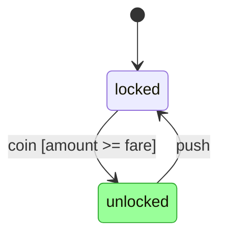

# harel — specification

Status: **draft v2**. Normative unless a section says "informative."
Spec version: **0.0.1** (see `VERSION`; synchronized across the harel repos).
Keywords MUST / SHOULD / MAY per RFC 2119.

## 0. References

- Miro Samek, *Practical Statecharts in C/C++ — Quantum Programming for Embedded
  Systems* (PSiCC). The canonical hierarchical-state-machine (HSM) dispatch and
  transition algorithm. **Implementers SHOULD follow PSiCC's RTC/LCA algorithm.**
  The outermost state is named **`top`** after PSiCC.
- David Harel, *Statecharts: A Visual Formalism for Complex Systems* (orthogonal
  regions, hierarchy, history).
- UML 2.x State Machines (terminology; behavioral semantics where not overridden).
- CEL — Google Common Expression Language (<https://cel.dev/>), the guard /
  expression language (§6).
- `cns_statemachine` (prior art: a Ruby HSM with a YAML machine format). harel keeps
  its vocabulary — `top`, `esvs`, `on_events`, `transition_to`, `defer`, `publish`,
  `event_types` — and replaces raw Ruby guards/actions with CEL + structured actions.

## 1. Goals

1. **One definition, many runtimes.** A machine is defined once in YAML; an engine in
   any language runs it. Cross-language agreement is guaranteed by the conformance
   suite (§9), the ultimate arbiter of correct behavior.
2. **Full statechart semantics:** hierarchy, orthogonal regions, history, defer,
   timers, run-to-completion.
3. **Active objects:** each instance owns an event queue; instances are spawned
   dynamically and communicate only by publishing events (no shared mutable state).
4. **Portable, sandboxed expressions:** guards in CEL; actions are a small structured
   set whose computed values are CEL. Host scripting languages are pluggable.
5. **Extended state done right:** typed variables (`esvs`) declared **inside states**,
   hierarchically scoped — not a global blob. External values are esvs too (§4.4).
6. **Robust over time:** defined faults (§5.10), external-change handling (§5.4),
   versioned definitions + safe-point migration (§10).
7. **Pluggable infrastructure:** the event bus, queue, clock, and store are adapters
   with a simple in-memory default for tests (§8); machine semantics don't depend on
   the transport.
8. **Contracts:** declare and statically check that a machine provides an interface (§7).
9. **Application-agnostic engine.** No domain concepts.

## 2. Conformance

An implementation is **conformant** iff it passes every case in the conformance suite
(§9), which lives in its own repository — **[`fruwehq/harel-conformance`](https://github.com/fruwehq/harel-conformance)**
(this repo holds only the normative text: `SPEC.md`, `schema/`, `examples/`).
Where prose and the suite disagree, the suite wins and a bug MUST be filed against
this document. Implementations MAY add guard/action languages and adapters; they MUST
NOT change core dispatch semantics. Machine YAML MUST validate against
`schema/machine.schema.json` before execution.

**Parsing.** harel YAML MUST be parsed under the **YAML 1.2 core schema** (only
`true`/`false` are booleans). Identifiers (state/event/variable names) MUST match
`^[A-Za-z_][A-Za-z0-9_]*$`. The names `top`, `id`, `parent`, `event`, and the events
`initial`, `entry`, `exit`, `env`, `error`, `done` are **reserved** (§3, §5).

**Library API.** An implementation MUST expose a programmatic API usable as a
**library** — a host program can drive the engine **without** invoking the CLI (§13) or
touching the file-backed store. The surface is **language-idiomatic** (not standardized
across languages), but MUST at minimum let a host: load and validate a definition;
register definitions and create a root instance with a given `id` and `external` esvs;
deliver a typed event and run to quiescence (§5.7); advance the virtual clock (§5.9);
read an instance's status, active configuration, and esvs; and snapshot/restore an
instance (§8). The CLI is a thin wrapper over this API; cross-language behavioral parity
is pinned by the conformance suite (§9), not by the API's shape.

## 3. Concepts

- **Machine definition** — a YAML document describing one *kind* of statechart, with a
  single outermost state, `top`.
- **Machine instance** (a.k.a. **active object**) — a running statechart: a definition
  + **extended state** (`esvs`, §4.4) + an **event queue** + a **deferred set** (§5.8)
  + a **state configuration** (active states; >1 with orthogonal regions). Has a
  stable **instance id** (`id`) and a **parent** id, and records the **definition
  version** it runs under. State is per-instance; instances never share variables.
- **State** — `simple` (leaf), `composite` (one region of substates), `orthogonal`
  (≥2 regions), or `final`. `top` is the outermost composite/orthogonal state.
- **Region** — an independent area of a composite/orthogonal state with its own active
  substate. Orthogonal regions run within one RTC step of the *same* instance
  (synchronous), unlike spawned instances (asynchronous).
- **Pseudostates** — the **initial transition** of a composite/region, `final`,
  `history` (shallow/deep), and the **choice** pseudostate (§5.5.1). *Static* conditional
  branching is expressed by **guarded transition lists** (§4.5, first passing guard wins,
  the UML *junction*); *dynamic* branching — compute a value, then branch on it within one
  step — uses a **choice** pseudostate.
- **Event** — an occurrence of a declared **event type** carrying a typed payload.
  Some event types are **reserved lifecycle events**: `initial`, `entry`, `exit`
  (state lifecycle, §5.3/§5.5), `env` (external change, §5.4), `error` (fault, §5.10),
  `done` (orthogonal completion, §5.6).
- **Transition** — `source --event [guard] / action--> transition_to`. Kinds:
  **external** (default), **internal** (no exit/entry; action only), **local**. May be
  guarded.
- **esv** — an extended-state variable (typed; declared in a state; §4.4).
- **Contract** — a named interface (required events, states, spawns; §7).

## 4. Machine definition (YAML)

The `schema/machine.schema.json` JSON Schema is normative for structure; this section
gives meaning. See `examples/full.yaml` (every feature) and `examples/minimal.yaml`.

```yaml
format: 1                  # grammar version (optional; defaults to 1)
id: download               # definition id (required, stable)
version: 1                 # this definition's version, for migration (optional; default 1)
contracts: [download]      # interfaces this machine claims to satisfy (§7)
subscribe: []              # external event types this machine listens for (§5.7)

events:                    # event-type declarations (the alphabet) (§4.3)
  connected: {}
  chunk:  { payload: { bytes: { type: int, required: true } }, scope: internal }
  download_done: { payload: { id: { type: string } }, scope: local }

top:                       # THE outermost state (PSiCC "top"); holds machine-wide
  esvs:                    #   esvs, listeners, and the initial transition (§4.4)
    password: { type: string, external: true }   # seeded by host; read-only; retained
    bytes:    { type: int, init: 0 }
  on_events:
    env:   { guard: "event.payload.changed.password != password", transition_to: reprovision }
    error: { transition_to: failed }             # fault handling is just a listener
  initial: { transition_to: idle }               # an initial *transition* (§5.3)
  states:
    idle:
      on_events:
        connected: { transition_to: idle }
    reprovision:
      entry:
        - refresh: { only: [password] }          # adopt the changed external value
    failed: {}
```

### 4.1 Top-level fields
- `format` (int, optional, default `1`) — grammar version the engine parses against.
- `id` (string, required, stable) — definition id.
- `version` (int ≥1, optional, default `1`) — *this definition's* version, bumped by
  the author; input to migration (§10). `format` versions the language; `version`
  versions the machine.
- `contracts` (list, optional) — declared interfaces (§7).
- `subscribe` (list of event-type names, optional) — external events this machine
  receives by subscription (§5.7).
- `events` (map, optional but RECOMMENDED) — typed event types (§4.3). If present, only
  declared events MAY be delivered and payloads MUST validate.
- `languages` (map, optional) — `{guard, action}` ids; defaults `{guard: cel, action:
  harel}`.
- `migrations` (list, optional) — forward migrations from older versions (§10).
- `top` (StateNode, required) — the outermost state (§4.5). All behavior lives under it.

### 4.2 No global blob
There is **no** top-level `data`/`params`/`context`. Machine-wide *mutable* state is
declared as `esvs` on `top` (§4.4). Machine-wide *external/immutable-ish* inputs are
`external` esvs (also on `top`). Object identity is the intrinsic `id`/`parent`.

### 4.3 Events (typed payloads, scope)
`events: { name: { payload?: { field: {type, required?, default?} }, scope? } }`.
- `payload` fields are typed; `required: true` MUST be present; extras are rejected.
  Validation happens at delivery; an invalid payload is a host error (not enqueued).
- `scope ∈ {internal, local, global}` (default `internal`) governs **undirected**
  delivery (§5.7): `internal` = self only; `local` = the publishing instance's tree;
  `global` = the whole bus. **Directed** publishes (`to:`) ignore scope. Per "make the
  default explicit," authors SHOULD write `scope` when an event crosses instances.
- Reserved lifecycle events (`initial`/`entry`/`exit`/`env`/`error`/`done`) are not
  declared here.

### 4.4 Extended-state variables (`esvs`)
`esvs` are Harel/Samek *extended state* — declared **inside states**, never globally.
A state (including `top`) MAY carry an `esvs` block:

`esvs: { name: { type, init?, external? } }`.
- `type ∈ {string, int, float, bool, map, list}`.
- `init` — initial **literal** value, assigned **on entry** to the declaring state
  (§5.1). Omit ⇒ starts unset (`null`). A non-null `init` MUST match `type`. (Dynamic
  initialization is done with an `entry` action.)
- `external: true` — the value is **seeded from the host** at entry (resolved settings/
  secrets/environment), is **read-only** to `assign`, and **retains** its value until
  re-seeded (state re-entry) or adopted via `refresh` (§5.4). External esvs are how a
  machine *owns* a copy of an outside value (e.g. a provisioned password).

**Scope.** A variable is visible to its declaring state, that state's substates, and
their guards/actions/timers. Resolution walks **up** the active hierarchy; an inner
declaration **shadows** an outer one. `top`'s esvs are in scope everywhere. Lifetime,
re-init, and write rules: §5.1.

### 4.5 StateNode
- `type`: `simple` (default) | `composite` | `orthogonal` | `final`.
- `esvs`: variables scoped to this state (§4.4).
- `entry`, `exit`: ordered action lists run on entry/exit (§6).
- `initial`: the **initial transition** (`{ transition_to, guard?, action? }`),
  required for `composite`; each `orthogonal` region declares its own. Taken on entry
  to reach a substate; MAY run an action (§5.3).
- `states`: nested states (for `composite`).
- `regions`: list of `{ initial, states }` (for `orthogonal`, ≥2, ordered §5.6).
- `on_events`: map `event -> Transition | [Transition,...]` (a list is ordered; first
  passing guard wins). Listeners — including `env`/`error` — live here.
- `after`: list of `{ duration, transition_to?, action?, guard? }` timers (§5.9).
- `defer`: event names deferred while this state is active (§5.8).
- `history`: `none` (default) | `shallow` | `deep`.
- `choice`: an ordered **branch list** (§5.5.1). Declaring it makes the node a **choice
  pseudostate**; it is then mutually exclusive with the state fields above (no `esvs`,
  `entry`, `exit`, `states`, `on_events`, …).

### 4.6 Transition
- `transition_to`: target state id, dotted for nesting; omit ⇒ internal. MAY name a
  **choice pseudostate** (§5.5.1), which resolves to a real state within the step.
- `guard`: CEL boolean (optional). `lang:` MAY override the language.
- `action`: ordered action list (optional).
- `internal` / `local`: bool (§5.5).

## 5. Execution semantics (normative)

### 5.1 Extended state (lifetime, scope, writes)
- **Initialization.** A state's `esvs` are created and assigned their `init` (or `null`)
  **when the state is entered**, *before* its `entry` actions. `external` esvs are
  seeded from the host at that point. They are **destroyed on exit** (after `exit`
  actions). Re-entry **re-initializes** (history restores the *configuration*, not
  variable values). `top`'s esvs initialize once, at instance creation.
- **Reads.** A name resolves up the active hierarchy, innermost first (shadowing).
  Referencing a name not in scope is a load-time error.
- **Writes.** `assign` writes the **nearest enclosing** declaration. `external` esvs are
  read-only to `assign` (adopt changes via `refresh`, §5.4). Type-checked.

### 5.2 Run-to-completion (RTC)
Each instance processes **one event completely** — all transitions, exit/entry/initial
actions, orthogonal dispatch — before dequeuing the next. No re-entrancy mid-step.
Events produced during a step are enqueued (§5.7), never recursed. RTC is
single-threaded per instance.

### 5.3 Entry, exit, and the initial transition
On entering a state: initialize its `esvs` (§5.1) → run `entry` actions → if
composite/orthogonal, take its `initial` transition(s) (running any initial `action`)
to reach substates. On exiting: run `exit` actions → destroy its `esvs`. `entry`,
`exit`, and `initial` are the **state lifecycle** (the cns `SIG_STATE_ENTRY` /
`SIG_INITIAL_STATE` analogues); ordering MUST match PSiCC and is pinned by the suite.

### 5.4 External change (`env`) and `refresh`
External esvs (§4.4) are seeded once and then owned by the machine. When the host
observes that an external source changed, it **posts the reserved `env` event** to the
instance with `payload.changed = { name: newValue, ... }`. The host monitors; the
machine reacts. A machine handles `env` in `on_events` like any event (compare its
current esv to `event.payload.changed.<name>`, guard, transition). The **`refresh`**
action (§6) adopts changes into the in-scope external esvs: `refresh: {}` copies all
names present in `event.payload.changed`; `refresh: { only: [a,b] }` copies a subset.
`refresh` is valid only while handling an `env` event.

### 5.5 Transition execution
For an external transition `src --> tgt` with actions `a`:
1. **LCA** = least common ancestor composite of `src` and `tgt`.
2. **Exit** from the current leaf up to (not including) LCA, innermost-first; per state
   run `exit` then destroy `esvs`.
3. Run transition actions `a`.
4. **Enter** from LCA down to `tgt`, outermost-first; per state initialize `esvs` then
   run `entry`; take `initial` transitions as needed (§5.3).
`internal`: actions only; no exit/entry. `local`: LCA is the containing composite
itself (no exit/re-entry of it). Ordering pinned by the suite.

### 5.5.1 Choice pseudostates (dynamic branching)
A node with a `choice` field is a **choice pseudostate**: a transient branch point that is
resolved *within* a transition and is **never part of the active configuration** — it has
no `esvs`, `entry`, `exit`, or `history`. `choice` is an ordered list of **branches**
`{ guard?, transition_to, action? }`. Exactly **one** branch MUST be the **default** (no
`guard`) and MUST be last; it is the `else`.

When a transition — or an `initial`, an `after`, or another branch — has `transition_to` a
choice `C`, the transition is a **compound transition** resolved before any exit/entry:
1. The triggering transition's `action` runs (in the **source** scope).
2. At `C`, branches are tried **in order**; the first whose `guard` passes — or the default
   — is selected, and its `action` runs. If the selected `transition_to` is another choice,
   repeat; otherwise it is the **final target** `tgt`.
3. The transition then executes as an external transition `src --> tgt` (§5.5): exit from
   the source leaf up to `LCA(src, tgt)`, then enter down to `tgt`. The choice(s) traversed
   contribute **no** exit or entry.

Branch guards and actions read/write esvs in the **source** scope (so a branch sees values
just assigned by the triggering transition — this is what makes it *dynamic*, unlike a
guarded transition list whose guards are evaluated before its action). The entire
resolution is one atomic RTC step: a fault anywhere rolls the whole step back (§5.10).

**Static validation** (load time): every choice has exactly one default branch; every
`transition_to` resolves; and the graph of choices reachable through `transition_to` is
**acyclic** (no choice can reach itself), so resolution always terminates at a real state.

### 5.6 Hierarchy & orthogonal regions
On dispatch of event `e`, search from the most deeply nested active state up the parent
chain; the first state with a transition for `e` whose guard passes handles it;
ancestors aren't consulted further for that region. If `e` is deferred by the active
config and unhandled, it is deferred (§5.8); otherwise unhandled events are discarded
(hosts MAY log). An `orthogonal` state offers `e` to **every** region in **declared
order** within one RTC step; the configuration is the union. When **all** regions reach
`final`, the engine generates a `done` event for the orthogonal state's parent.

### 5.7 Active objects, queues, spawning, the bus
- Each instance has a **FIFO queue**; `dispatch` = dequeue one event, run one RTC step.
  There is **no periodic tick**; the only driver is event arrival (timers included).
- **Tree.** The root is created by the host; others are **spawned** by an action:
  `spawn(def, payload?) -> id`. A child runs independently with its own queue. The
  spawner gets the child id (via `result:` into an esv). A spawned instance's `external`
  esvs MAY be seeded from the spawn payload by name. **Ids are deterministic:** the root
  id is supplied by the host/CLI (`new <id>`), and a spawned child's id is derived from
  its parent's id and a per-parent monotonic spawn counter (e.g. `parent/1`), so every
  engine allocates identical ids and any instance is addressable in conformance and the
  CLI.
- **Publishing.** `publish` hands an event to the **bus** (§8):
  - **Directed** — `to:` resolves (CEL) to an instance id or list (e.g. `parent`, `id`,
    a stored child id); delivered to exactly those instances, **ignoring scope**.
  - **Undirected** — delivered to instances that `subscribe` to the event type and lie
    within the event's `scope` (`internal`=self, `local`=this instance tree,
    `global`=bus). An instance always receives its own `internal` publishes.
  Delivery is asynchronous (enqueue for the target's next dispatch), per-pair FIFO.
- **Termination.** An instance whose `top` reaches `final`, or that runs `stop`,
  terminates: children stop first (post-order), `exit` actions run up the tree, and a
  `done` event is delivered to the parent.

> A manager-of-many (see `examples/full.yaml`) without breaking "one machine = one
> state": a `downloads` instance spawns a `download` per file; each is its own machine;
> a finished `download` does `publish { event: download_done, to: parent }`.

### 5.8 Deferred events
A state MAY list events in `defer`. UML **deferred-set** semantics (not a tail
re-queue): an unhandled event whose type is in the active config's effective defer set
moves to the instance's **deferred set** (order preserved). **Edge-triggered:** when an
RTC step changes the configuration, every deferred event no longer deferred is moved,
in order, to the **front** of the queue. (An instance's state changes only by
processing its own events, so re-checking on state change suffices — no poll, no
busy-loop.) The deferred set is part of the snapshot (§8).

### 5.9 Timers (clock via adapter)
Time comes from an injected **clock adapter** (§8), keeping the engine pure and tests
deterministic. A state's `after: [{ duration, transition_to?, action?, guard? }]`
schedules, on entry, a timer; on fire the engine enqueues an internal time event,
dispatched as an ordinary guarded transition. Exiting the state cancels its timers. In
conformance tests a **virtual clock** is advanced explicitly (`advance:`); no wall-clock
time is used. Outstanding timers are part of the snapshot.

### 5.10 Action faults
An RTC step (exit → transition → entry actions) is **atomic**. If an action raises, the
engine **aborts the step** (no partial transition; the triggering event goes to a
**dead-letter**) and **faults** the instance. If a state in scope handles the reserved
**`error`** event in `on_events`, the engine delivers `error` (payload carries the
fault) and dispatches it as a normal transition; otherwise the instance enters
**`__faulted__`** and stops dispatching until a host `reset`. Faulting is per active
object. **Hangs:** CEL + structured actions are total and bounded (no loops/IO) and
cannot hang; pluggable host languages get a clock-adapter **deadline** (overrun ⇒
fault). Faults/dead-letters/status are observable (§8).

## 6. Guard & action languages

**Guards = CEL** over the in-scope `esvs` plus `event` (`event.payload.*`) and the
intrinsics `id`/`parent`. CEL is side-effect-free, non-Turing-complete, and has
multi-language runtimes — that is what makes guards portable. Engines MUST provide CEL
and MAY provide host languages via `lang:` / `languages.guard`.

**Actions = a structured set (id `harel`)**; computed values are CEL over `(esvs,
event, id, parent)`:

| action | form | effect |
|---|---|---|
| assign | `{ assign: { var: "<cel>", … } }` | set the nearest in-scope esv (typed) |
| publish | `{ publish: { event: name, to?: "<cel>", payload?: { k: "<cel>" } } }` | hand an event to the bus (directed or subscribed) |
| refresh | `{ refresh: {} }` or `{ refresh: { only: [name…] } }` | adopt `env` changes into external esvs (§5.4) |
| spawn | `{ spawn: { def: id, payload?: {…}, result?: var } }` | spawn a child; id → `result` |
| stop | `{ stop: {} }` | terminate this instance |

`action` is an ordered **list**, so multiple `publish`es (or any mix) are allowed.
Action values are CEL; the structured set is total and bounded. Richer needs ⇒ a
pluggable host action language (forfeiting the bounded guarantee). Published/spawned
event names and payloads MUST type-check against `events`.

**Why CEL and not native YAML?** Structure and *literals* are native YAML (`type`,
`init`, payload defaults). Only **guards** and **computed values** (an `assign` RHS, a
published payload value) are CEL — those are runtime expressions over state, which YAML
cannot represent (`bytes + n` is not data). cns used raw Ruby here; CEL keeps it
sandboxed and language-portable.

## 7. Contracts (interfaces)

```yaml
contract: 1
id: download_manager
requires:
  events: [add]          # handled in some reachable state
  states: [online]       # declared
  spawns: [download]     # defIds it must be able to spawn
```
A static **validator** checks a machine against each declared contract: every required
event has a handler somewhere; every required state exists; every required `spawn` def
appears in an action. Contract checking is part of conformance. Contracts are
extensible: a machine MAY satisfy several; a newer contract MAY add requirements.

## 8. Persistence & host adapters

The engine is pure logic; the host provides **adapters**, each with a **simple
in-memory default the conformance harness uses**:
- **Bus** — routes published events (directed + subscription/scope, §5.7). Default:
  in-process delivery. Production: a network/broker transport.
- **Queue** — per-instance FIFO (default: in-memory).
- **Clock** — `schedule/cancel/now` (§5.9); default: the virtual clock.
- **Store** — load/save an **instance snapshot**: `{ def_id, def_version, id, parent_id,
  status, state_config, esvs, queue, deferred, timers, dead_letter, history }`, where
  `esvs` is the live values of all in-scope variables. Snapshots MUST round-trip and be
  JSON/YAML-representable (portable across language implementations). `status ∈ {active,
  faulted, terminated}`.
- **Observer** (optional) — a **passive** per-step callback. An implementation MAY accept
  an observer; if present it is invoked **once per completed RTC step** with a record
  `{ instance, event, transition, entered, exited, published, spawned, faulted }` (the same
  shape as the §14 `step` record). It fires for **both** automatic (run-to-quiescence) and
  manual (§14 `step`) processing, and MUST be purely observational — it MUST NOT affect
  dispatch, ordering, or any semantics. It is the spec-native mechanism for transition
  logging, live visualization (§12), and agent/UI feeds. (Host-language *diagnostic*
  logging is a separate, implementation-only concern and is out of scope here.)

Adapters are selected by the host; the machine YAML never names a transport.

An implementation SHOULD provide three **standard store backends** behind the store
adapter: `file` (portable snapshot files, the default), `mem` (in-memory, ephemeral),
and `sqlite` (a single-file database). They are selected by a scheme at the host/CLI
boundary (§13.1) and are behaviorally identical — `mem` and `file` are the
in-memory/portable defaults, `sqlite` the persistent single-file option; the machine
semantics never depend on which is used.

## 9. Conformance test format (normative)

The cases themselves live in **[`fruwehq/harel-conformance`](https://github.com/fruwehq/harel-conformance)**
(at `conformance/<case>/`); this section defines their normative format. Implementations
pin that repository to obtain the suite.

```
conformance/<case>/
  machine.yaml          # one or more `---`-separated definitions; first is root
  contracts/*.yaml      # optional, for contract-validation cases
  test.yaml             # the scenario + expectations
```

```yaml
title: external change triggers reprovision
external: { password: 'old' }       # initial host-supplied external esvs on root
steps:
  - send: { event: add, payload: { url: 'http://x' } }
    expect:
      config: [online]              # active leaf state ids (sorted)
      esvs: { active: 0 }
      published: []                 # events handed to the bus this step, in order
  - send: { event: env, payload: { changed: { password: 'new' } } }
    expect:
      config: [reprovision]
  - advance: 10s                    # virtual-clock advance; fires due timers
    expect:
      config: [connecting]
  - send: { event: bogus }
    expect:
      rejected: true                # undeclared/invalid -> not enqueued
trace: optional                     # if set, exact entry/exit/action ordering
```
A run: validate against the schema, load definitions, **create the root instance with
id `root`**, then per step apply `send`/`advance`, **run all instances to quiescence**,
and check expectations. Specifics:
- A `send` targets the root by default, or another instance via `instance: <id>`
  (spawned child ids are `root/1`, `root/2`, … per §5.7).
- `config` (sorted) and `esvs` in an `expect` refer to the **addressed** instance
  (the root unless `instance:` is set). `esvs` asserts the **resolved in-scope** values
  (innermost declaration wins, as a guard would read them). Assert other instances with
  `instances: { <id>: { config?, esvs?, status? } }`. `status ∈ {active, faulted,
  terminated}`; a terminated instance is gone from `config`.
- `spawned` (defIds) and `published` (event names) are the per-step lists across the
  whole run, in order. `rejected: true` asserts the step's event failed validation.
- `external: { name: value }` at the top seeds the root's `external` esvs; a step's
  `env` event (`payload.changed`) drives later changes (§5.4).
- A case MAY set `roundtrip: true`: the harness serializes and reloads **every**
  instance's snapshot (§8) between steps; behavior MUST be identical, exercising
  snapshot round-trip.
- `status` (of the addressed instance) and `dead_letter: true` (a dead-letter record
  exists) MAY be asserted in an `expect`.
- A case MAY instead assert **static validation** (with no `steps`):
  `static: { valid: bool, errors?: [str…] }` runs the schema + contract validator (§7)
  and checks the outcome.
- A **migration** case provides versioned machine files (`v1.yaml`, `v2.yaml`, …)
  instead of `machine.yaml`; the root starts on the lowest version. An `upgrade: <n>`
  step makes version `n` available and migrates eligible quiescent instances (§10).

The suite MUST cover: leaf transitions; CEL guards (incl. guarded transition lists,
first-match-wins, and **choice** pseudostates §5.5.1); internal/local/external; LCA
ordering; `initial` transitions with
actions; composite & orthogonal (region order + `done`); shallow/deep history;
typed-payload accept/reject; `defer`; timers (virtual
clock); `esvs` scope/shadow/re-init; `external` esvs + `env`/`refresh`; publish
(directed, subscription, scope) + FIFO; spawn/stop + child cleanup; faults (`error`
handled and not, dead-letter); contracts; snapshot round-trip + migration. The
operator CLI surface is pinned separately by CLI conformance (§13.6).

## 10. Versioning, hot-swap & migration (normative)

Definitions are **immutable and versioned** (`version`). A snapshot records
`def_version`.
- **10.1 Pin by default.** A live instance keeps its original version until it
  terminates; the host retains old definitions while any instance pins to them. New
  instances use the new version.
- **10.2 Forward migration at a safe point.** A newer definition MAY declare:
  ```yaml
  migrations:
    - from: 1
      to: 2
      when: "state in ['up','down']"            # CEL over a `state` binding
      state_map: { up: online, down: offline }   # remap active leaves
      esvs: [ { assign: { new_var: "old_var" } } ]
  ```
  Applied **only at a safe point**: the instance is **quiescent** (empty queue, no
  in-progress RTC, empty deferred set) **and** its configuration satisfies `when` and is
  covered by `state_map`. Otherwise it stays pinned and retries next quiescence.
  Migration is snapshot-atomic (config remapped, esvs transformed, `def_version`
  bumped, or nothing).
- **10.3 Event-schema evolution.** Payloads SHOULD evolve **additively** (add optional
  fields; never repurpose/retype/require). For breaking changes, the recommended
  pattern is an **adapter machine** (anti-corruption layer) that subscribes to legacy
  events and publishes current ones — no special engine feature needed.

## 11. Non-goals / future (informative)

- **SaaS / distributed bus & agent hosting:** instances communicate only via published
  events, so the bus can be network-backed without changing semantics. A multi-tenant
  host exposing "legal events from the current state" to LLM agents (forcing
  well-maintained agent state) is a separate product layer.
- Visual editor, codegen, real-time scheduling beyond §5.9.
- Cross-instance transactions; instances are independent active objects by design.

## 12. Visualization & export (informative)

A machine — and the live state of an instance — can be rendered for humans. Export is
**tooling**, not core semantics, but the mapping is defined here so every
implementation produces the same diagram. Exporters are **pluggable by format**, and
**Mermaid `stateDiagram-v2`** is the built-in default (renders on GitHub and most doc
tools, no dependencies, and supports live highlighting). Other targets — PlantUML
(exact history pseudostates, SVG), SCXML (machine interchange) — MAY be added behind
the same interface later.

**Interface.** `export(machine, format="mermaid", state_config?) -> string`.
- Without `state_config`: the **static structure**.
- With `state_config` (from a snapshot/observer, §8): the same diagram with the active
  leaves **and their ancestors** marked — i.e. **current-state visualization**. A live
  view re-exports (or re-emits just the highlight) on each observer step.

**Mermaid mapping (`stateDiagram-v2`):**

| harel | Mermaid |
|---|---|
| `top` | the diagram root (its substates emitted at top level) |
| composite state `S` | `state S { … }` |
| orthogonal regions | regions inside `state S { … }` separated by `--` |
| `initial: { transition_to: X }` | `[*] --> X` (any initial `action`/`guard` as the edge label) |
| `final` state `F` | `F --> [*]` |
| `on_events: { e: { transition_to: T, guard: g } }` | `S --> T : e [g]` |
| internal transition (no `transition_to`) | no edge (optionally a note) |
| `after: { duration: d, … }` | edge labelled `after(d)` |
| history (`shallow`/`deep`) | annotated (Mermaid has no history pseudostate; PlantUML `[H]`/`[H*]` is exact) |

Edge labels SHOULD read `event [guard] / action-summary`, kept short; the full actions
live in the YAML.

**Current-state highlight.** Given `state_config`, emit `classDef active <style>` and
`class <active leaves + their ancestors> active`. Under orthogonal regions several
leaves are active and all are highlighted.

Example — the turnstile (`examples/minimal.yaml`), currently in `unlocked`:


## 13. Command-line interface (normative)

Every implementation MUST provide a `harel` CLI with the commands, options, exit
codes, and JSON output below, so operators and tests interact with any language's
engine **identically**. (This CLI is a thin wrapper over the required programmatic
*library* API of §2; that API stays language-idiomatic, and only the CLI and the
JSON/snapshot formats are standardized — the conformance suite already guarantees
behavioral parity.)

### 13.1 The store
CLI state persists in a **store** selected by `--store <spec>` (default
`$HAREL_STORE`, else `./.harel`). A `<spec>` carries an optional **scheme prefix**
that picks a backend; a bare value with no scheme is equivalent to `file:` for
back-compat:
- `file:<dir>` — JSON snapshot files under a directory. **Default** when no scheme
  is given: a bare `<dir>` (or `./.harel`).
- `mem:` — in-memory and **ephemeral**. It is only meaningful **within a single
  process** (e.g. one `run` batch/streaming session, §13.7, or a test); state does
  **not** persist across separate CLI invocations.
- `sqlite:<path>` — a single-file **SQLite** database.

A store holds the live instances (their snapshots, §8), registered definitions, and
the virtual clock. Its on-disk/in-memory layout is an implementation detail; the
normative contract is CLI behavior + the JSON I/O (§13.4). All backends MUST be
behaviorally identical (same CLI results, same snapshot JSON); the machine semantics
never depend on which is used. A state-changing command loads the affected instances,
runs **all** instances to quiescence (§5.7), and persists atomically.

### 13.2 Global options & exit codes
- `--store <spec>` — the store (above). `--json` — machine-readable stdout (otherwise
  human-readable). `--help` / `--version`.
- Exit codes (normative): `0` success · `2` usage error · `3` validation error ·
  `4` not found (instance/definition) · `5` instance faulted · `1` other runtime
  error. Diagnostics go to **stderr**; the command result goes to **stdout**.

### 13.3 Commands
| command | effect |
|---|---|
| `validate <machine.yaml>` | schema + static checks (references, contracts). Exit 3 on failure. |
| `export <machine.yaml> [--format mermaid] [--state <instance>]` | diagram to stdout (§12); `--state` highlights that instance's current config. |
| `new <id> <machine.yaml> [--external k=v]…` | register the definition and create a root instance with intrinsic id `<id>` (exit 2 if it already exists); print its initial state (§13.4). |
| `send <instance> <event> [--payload k=v]… [--payload-json <json>]` | deliver `event`, run to quiescence; print the resulting state (§13.4). |
| `advance <duration>` | advance the virtual clock (`30s`, `5m`, …), fire due timers, run to quiescence. |
| `env <instance> --changed k=v[,k=v]…` | post the reserved `env` event with `payload.changed` (§5.4). |
| `state <instance> [--json]` | the instance's status, active leaves, and esvs (§13.4). |
| `list [--json]` | every instance in the store (§13.4). |
| `snapshot <instance>` | print the raw snapshot JSON (§8). |
| `restore <snapshot.json>` | load a snapshot into the store. |
| `mode [auto\|manual]` | show or set the processing mode (§14), persisted in the store. |
| `inject <instance> <event> [--payload k=v]… [--payload-json <json>]` | validate and **enqueue without processing** (§14); print the (unchanged) state (§13.4). |
| `step <instance> [--steps N]` | process N (default 1) RTC steps (§14); print the resulting state plus a `steps` list. |
| `inspect <instance>` | full internal state for debugging (§14): queue, deferred, timers, history, dead_letter. |

`--payload k=v` is repeatable; values are **coerced to the event's declared payload
types** (§4.3) and MUST validate, else exit 3. `--payload-json` supplies the whole
payload as one JSON object. `--external k=v` seeds `external` esvs at creation (§4.4).

### 13.4 JSON output (normative shapes)
With `--json`, stdout is exactly one of:
- `state` / `new` → `{ "instance": str, "def": "id@version", "status": "active|faulted|terminated", "config": [str…], "esvs": {…} }` (`config` sorted).
- `send` → the `state` object for the targeted instance plus `"published": [str…]` (events handed to the bus this run, in order).
- `list` → `[ { "id": str, "def": "id@version", "parent": str|null, "status": str, "config": [str…] }, … ]` (ordered by id).
- `validate` → `{ "valid": bool, "errors": [ { "path": str, "message": str }, … ] }`.
- `snapshot` → the §8 snapshot object.
- `mode` → `{ "mode": "auto"|"manual" }`.
- `inject` → the `state` object for the targeted instance (config unchanged, since it is not processed).
- `step` → the `state` object for the targeted instance plus `"steps": [ { event, transition, entered[], exited[], published[], spawned[], faulted }, … ]` (one record per RTC step taken, ≤ `--steps`).
- `inspect` → `{ "instance": str, "status": str, "config": [str…], "esvs": {…}, "queue": [event…], "deferred": [event…], "timers": [timer…], "history": {…}, "dead_letter": [record…]? }`.

Keys and types are part of the standard; implementations MUST match them.

### 13.5 Determinism
The CLI uses the **virtual clock** (§5.9): time advances only via `advance`, starting
at 0 in a fresh store. CLI sessions are therefore reproducible and testable. (A
real-time clock for daemon/operational use is a future option, §11.)

### 13.6 CLI conformance
CLI cases live alongside the engine suite in
**[`fruwehq/harel-conformance`](https://github.com/fruwehq/harel-conformance)** under
`conformance/cli/<case>/`, each a `cli.yaml` of steps run against a fresh temp store;
machine files referenced live in the case directory:
```yaml
steps:
  - run: [new, t1, machine.yaml]
    expect: { exit: 0 }
  - run: [send, t1, coin, --payload, "amount=100", --json]
    expect:
      exit: 0
      json: { config: [unlocked], status: active }
```
A harness invokes the implementation's `harel` binary; a case passes iff every step's
exit code and stdout match (`json` compared structurally; otherwise `stdout`
verbatim). This pins cross-language **CLI parity** the way §9 pins engine semantics.

The reference harness is **`conformance/run_cli.py`** (in `fruwehq/harel-conformance`),
run as `python conformance/run_cli.py --cmd "<invoke your harel>"` (e.g. `--cmd "harel"` or
`--cmd "python -m harel"`). It is language-agnostic — it executes every case as a
**subprocess** against the built/installed binary. Conformance MUST be demonstrated this
way (true black box); an in-process import of the implementation does NOT satisfy §13.6,
because it cannot catch packaging, entry-point, or I/O regressions an operator would hit.

A step MAY instead exercise **batch mode** (§13.7): it carries a `stdin:` list of argv
arrays (the NDJSON commands fed to the process) and an `expect.stream:` list compared
structurally, position by position, against the emitted NDJSON result objects:
```yaml
steps:
  - run: [run, -]
    stdin:
      - [new, t1, machine.yaml]
      - [send, t1, coin, --payload, "amount=100"]
    expect:
      exit: 0
      stream:
        - { ok: true, exit: 0, result: { config: [locked], status: active } }
        - { ok: true, exit: 0, result: { config: [unlocked] } }
```

### 13.7 Batch / streaming mode (normative)
For scripting and embedding, an implementation MUST support a streaming mode that drives
many commands in one process against one store and a single virtual clock:
- `harel run [-]` reads **stdin** as **NDJSON**: each non-empty line is a JSON array of
  argv tokens for one command — the same commands and options as §13.3, e.g.
  `["send","t1","coin","--payload","amount=100"]`. A bare `-` argument makes stdin
  explicit; blank lines are ignored.
- Commands execute **in order** against the single `--store` and one in-process virtual
  clock (§13.5); each runs all instances to quiescence (§5.7) before the next line.
- For each input line the implementation writes **exactly one** NDJSON object to
  **stdout**, in input order, flushed as it completes:
  `{ "ok": bool, "exit": int, "result": <value>, "error": { "message": str }? }`.
  `exit` is that command's §13.2 exit code; `ok` is `exit == 0`; `result` is the
  command's §13.4 JSON object when it defines one (as if `--json` were passed), the
  verbatim stdout string for non-JSON output (e.g. `export`), or `null` when there is
  none. On failure `result` is `null` and `error.message` carries the diagnostic.
- A failing line **does not** abort the stream; later lines still run. The **process
  exit code** is `0` iff every line had `exit == 0`, else the first non-zero `exit`.
- Determinism (§13.5) holds: the clock starts at the store's current time and advances
  only via `advance` lines, so a batch session is fully reproducible.

## 14. Introspection & stepping (normative)

A host MAY drive and observe an instance one run-to-completion (RTC) step at a time —
a debugging surface. §5.2 RTC is normally automatic ("the only driver is event
arrival"); this section makes manual control and introspection explicit.

**Processing modes.** An instance runs in either **auto** mode (deliver → run to
quiescence, §5.7 — the current and default behavior) or **manual** mode (events are
enqueued but **not** processed until an explicit `step`). The mode is host/operator
state; it MAY be persisted by the store (§8/§13.1) and switched at any quiescent
point. In manual mode `send`/`inject` enqueue without processing; `advance` (§5.9)
still arms and fires due timers (enqueuing their events) but defers their processing
to the next `step`. Determinism (§13.5) is preserved: a manual session is fully
reproducible because nothing runs until asked.

**Primitives** (the library API is language-idiomatic; the CLI verbs are pinned in §13):
- `inject(instance, event[, payload])` — validate (§4.3) and **enqueue without
  processing**, in either mode. Returns whether the event was accepted (a rejected
  event is not enqueued).
- `step(instance[, n])` — process exactly **one** RTC step per `n` (default `1`):
  dequeue one event, run the atomic exit→transition→entry, and enqueue any produced
  events. Returns one per-step record per `n`, each of the observer shape (§8):
  `{ event, transition, entered[], exited[], published[], spawned[], faulted }` — the
  driving `event`, the `transition` that fired (its target, or null for an internal
  transition / none taken), the states `entered`/`exited`, and the `published` events,
  `spawned` instances, and `faulted` flag for that step.
- `run_to_quiescence()` — process until every queue drains (auto semantics, §5.7).
- `inspect(instance)` — the full internal state, beyond `state` (§13.4):
  `{ status, config[], esvs{}, queue[], deferred[], timers[], history{}, dead_letter? }`.
  `queue`/`deferred` are the pending events; `timers` the armed `after` timers;
  `history` the recorded shallow/deep records.
